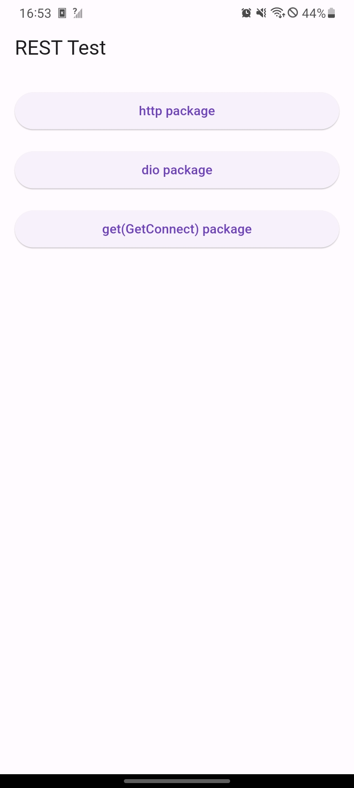
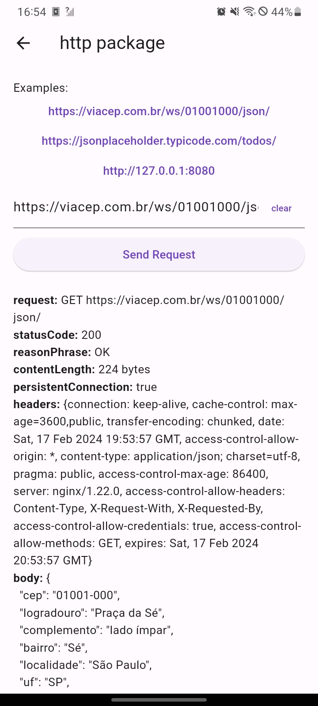

# rest_test

Application for testing REST requests in Flutter

### Screenshot

### Links

- Live Site URL: [https://hansmboron.github.io/rest_test/](https://hansmboron.github.io/rest_test/)

## Author

- Website - [Hans M Boron](https://www.mehsys.com.br)
- GitHub - [@hansmboron](https://www.github.com/hansmboron)
- YouTube - [@HansMBoron](https://www.youtube.com/c/HansMBoron)
- LinkedIn - [@hansmateusboron](https://www.linkedin.com/in/hansmateusboron/)